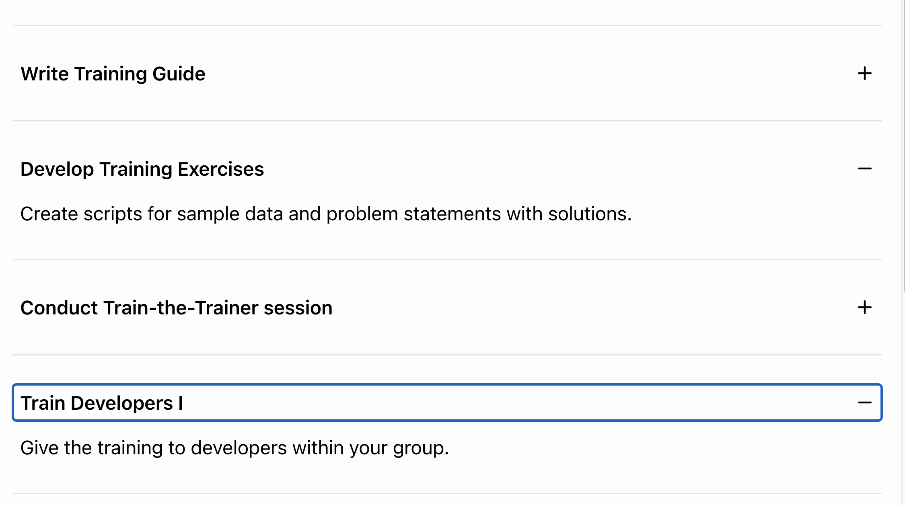
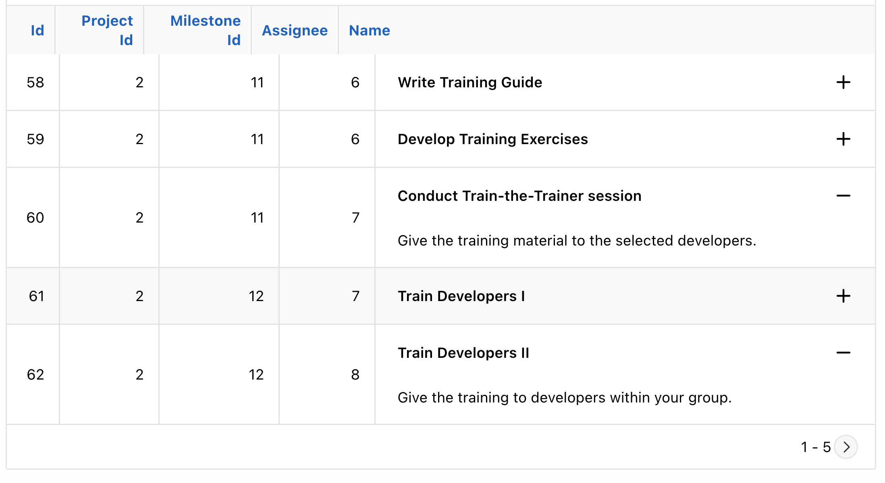
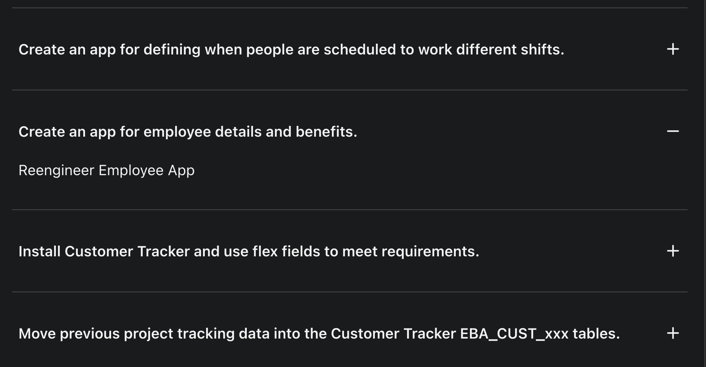

# APEX FAQ Template Component

This Template Component Plug-In allows you to display a collabsible FAQ-style list on your APEX page.

It also works in report columns, but breaks the column layout:

It respects the APEX theme colors:

You can finde a demo application [here](https://apex.oracle.com/pls/apex/r/hartenfeller_dev/template-component-demos/faq).

## How to use

- Download the plug-in file from the latest release
- Import the plug-in file into your application
- Create a new region of type "FAQ"
- Add query
- Assign two text columns to the plug-in attributes "Question" and "Answer"

